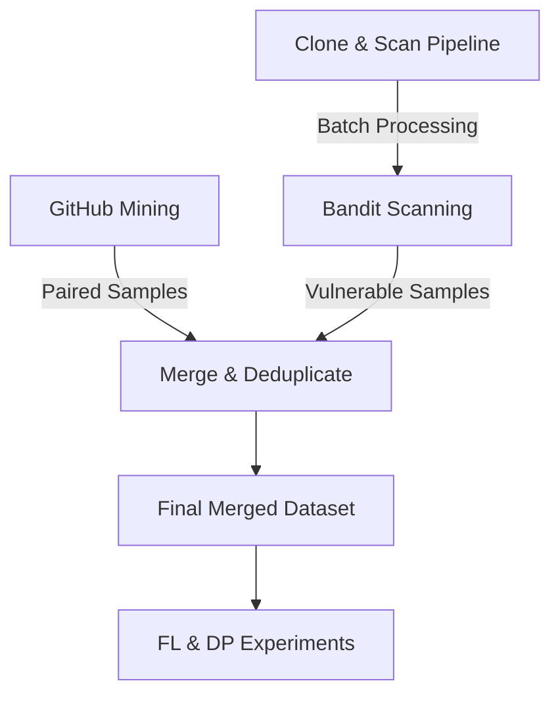

# SecureCode-FL: Dataset Expansion System

This directory contains tools designed to solve the "small dataset problem" (N=471) by automatically collecting, labeling, and merging new Python vulnerability samples.

## System Overview

The system follows a three-stage pipeline to increase dataset size while maintaining high-quality security labels without manual effort.



### 1. GitHub Miner (`github_vuln_miner.py`)
- **Function**: Searches GitHub for security-related commits in Python repositories (e.g., "fix sql injection").
- **Auto-Labeling**: 
    - Extracts the code **before** the fix (Label: `Error` / Vulnerable).
    - Extracts the code **after** the fix (Label: `Good` / Secure).
- **Categorization**: Uses keyword matching in commit messages to map samples to OWASP API Security categories.

### 2. Bandit Scanner (`bandit_scanner.py`)
- **Function**: Uses the Bandit SAST tool to identify vulnerabilities in Python source code.
- **Auto-Labeling**: 
    - Maps Bandit Test IDs (e.g., B608) to OWASP categories.
    - Captures the flagged function as a Vulnerable (`Error`) sample.
- **Reliability**: Filtered to only include "High" or "Medium" confidence findings.

### 3. Clone & Scan Pipeline (`clone_and_scan.py`)
- **Function**: Automates the collection of samples by cloning target repositories and running the Bandit scanner.
- **Targets**: Includes popular frameworks (Flask, Django, FastAPI) and **deliberately vulnerable** apps (DSVW, Vulpy) for guaranteed security samples.

### 4. Merge Tool (`merge_datasets.py`)
- **Function**: Consolidates all collected data with the original 471-sample dataset.
- **Integrity**: 
    - Deduplicates via MD5 hashing of normalized code.
    - Validates sample length and structure.
    - Generates a `merge_report.txt` with class balance and category statistics.

## How to Run

1. **Environment Setup**:
   ```bash
   pip install bandit pandas requests
   ```

2. **Run Mining (Paired Samples)**:
   ```bash
   set GITHUB_TOKEN=your_token_here
   python tools/github_vuln_miner.py
   ```

3. **Run Batch Scanning (Vulnerable Samples)**:
   ```bash
   python tools/clone_and_scan.py
   ```

4. **Merge & Finalize**:
   ```bash
   python tools/merge_datasets.py
   ```

## Integration with Paper
Update `config.py` to point to `data/merged_dataset.csv` before re-running experiments. The increased sample size (Target: 2,000+) will significantly improve the statistical significance of the results and the utility of Differential Privacy.
